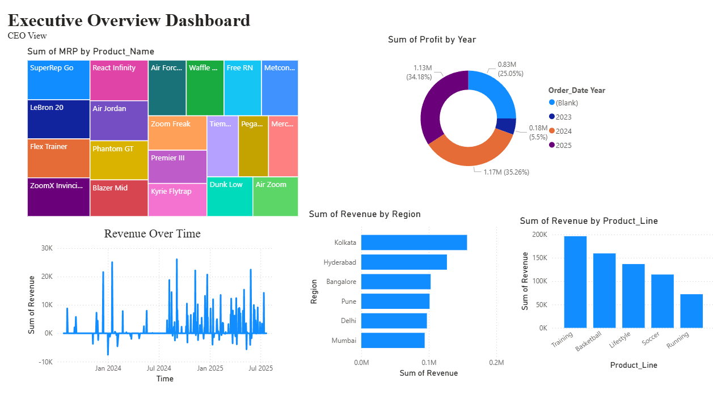

# Nike Sales Analysis Dashboard (Power BI)

## Project Overview

This project analyzes Nike sales data using Power BI to uncover insights related to revenue, profitability, product performance, and regional trends.

The dashboard supports business decision-making by identifying key performance indicators (KPIs) and highlighting areas for improvement.

---

## Business Objective

**Goal:**  
To analyze sales performance, profitability, product demand, and regional trends to improve revenue and reduce losses.

---

## Data Cleaning & Preparation

Before building the dashboard, the dataset was cleaned and transformed using Power Query.

### Key Cleaning Steps

- Converted `Order_Date` to proper date format using locale settings
- Fixed data types:
  - Revenue, Profit, Units Sold, Discount → Numeric
  - Product Line, Region, Gender → Text

- Handled missing values:
  - Replaced null values in _Units Sold_ and _Discount_ with 0
  - Filled missing _MRP_ values

- Standardized inconsistent region names:
  - Fixed variations of _Hyderabad_
  - Changed _Bengaluru_ to _Bangalore_

- Removed duplicate records
- Converted negative _Units Sold_ values to absolute values

- Cleaned and standardized the **Size column**:
  - 6–7 → Small
  - 8–9 → Medium
  - 10–11 → Large
  - 12 → Extra Large

These steps ensured the dataset was accurate and reliable for analysis.

---

## Dashboard Features

### Executive Overview Dashboard

Provides a high-level summary of business performance:

- Total Revenue and Profit trends over time
- Revenue distribution by Product Name (Treemap)
- Profit distribution by Year (Donut Chart)
- Revenue by Region
- Revenue by Product Line

---

## Key Visualizations

- **Treemap** → Revenue by Product Name
- **Line Chart** → Revenue over Time
- **Bar Chart** → Revenue by Region
- **Bar Chart** → Revenue by Product Line
- **Donut Chart** → Profit by Year

---

## Key Insights

- Some product lines generate significantly higher revenue than others
- Revenue trends vary over time, indicating seasonal or demand-based changes
- Certain regions (e.g., Kolkata and Hyderabad) perform better in revenue
- Profit distribution changes across years, reflecting shifts in performance
- Product categories like _Training_ and _Basketball_ contribute more to revenue

---

## Tools & Technologies Used

- **Power BI** → Dashboard and visualization
- **Power Query** → Data cleaning and transformation
- **DAX** → Calculations and KPIs

---

## Dashboard Preview

## Conclusion

This project demonstrates how raw sales data can be transformed into actionable insights using Power BI. By analyzing revenue, profit, and regional performance, the dashboard highlights opportunities to improve business strategy.

---

## Future Improvements

- Add discount impact analysis
- Include profit margin and additional KPIs
- Build interactive filters for deeper analysis
- Add forecasting for future sales trends

---
